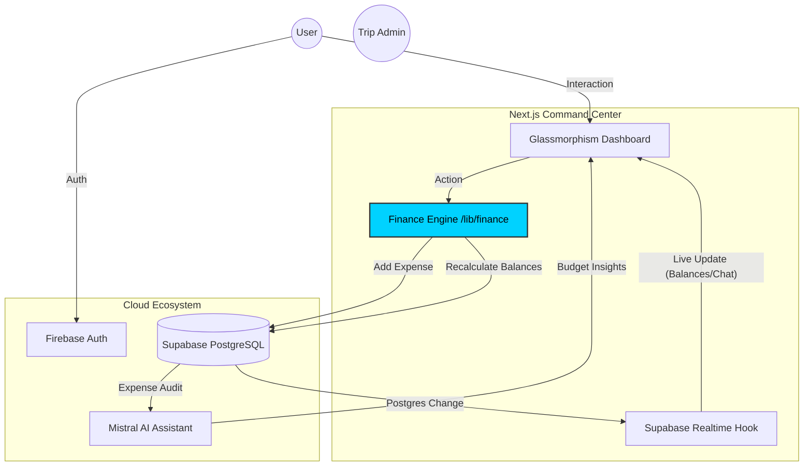

# 🌌 TripSync AI — Plan Together. Spend Smarter. Settle Instantly.

[](https://nextjs.org/)
[](https://mistral.ai/)
[](https://supabase.com/)
[](https://firebase.google.com/)

---

## 🏗️ System Architecture & Data Flow



---

## 🚀 1. The Vision

**TripSync AI** is a premium, cinematic travel management platform designed to eliminate the chaos of group trips. We've combined **high-performance AI** with a **state-of-the-art Fintech interface** to turn group planning from a chore into a premium experience.

### 🌑 Cinematic Fintech Aesthetic
Unlike traditional travel apps, TripSync AI features a **"Fintech Command Center"** design:
*   **Deep Space Theme**: Ultra-dark charcoal backgrounds with vibrant cyan and violet neon accents.
*   **Glassmorphism**: High-intensity backdrop blurs and translucent layers for a modern, airy feel.
*   **Micro-Animations**: Buttery smooth transitions powered by Framer Motion.
*   **Zero-Emoji Professionalism**: Swapped generic emojis for premium Lucide-react iconography.

---

## ✨ 2. Intelligence & Features

### 🤖 AI Core (Powered by Mistral Large)
*   **Instant Itinerary Generator**: Mistral AI drafts a realistic, day-wise plan based on your group's budget, destination, and unique preferences.
*   **Smart Budget Auditor**: Real-time financial analysis. The AI detects overspending in specific categories and provides actionable advice.
*   **AI Travel Assistant**: A dedicated companion that lives in your trip, ready to answer questions about your plan or suggest changes on the fly.

### 💸 Financial Command Center (Real-Time Fintech)
*   **Zero-Friction Splitting**: Track expenses in real-time. Whether it's a shared dinner or a flight, the app handles the math instantly.
*   **Real-Time Ledger**: A sophisticated backend engine (`recalculateBalances`) computes optimal debts instantly using a bipartite matching approach.
*   **Live Notifications**: Get notified the second someone adds an expense involving you or pays you back.
*   **One-Click Settlements**: Integrated mock payment flow to settle debts and clear the ledger instantly.

### 👥 Collaboration & Social
*   **Real-Time Group Chat**: Seamless coordination integrated directly into the trip dashboard.
*   **Live Voting/Polls**: Can't decide on the next activity? Create a poll and let the group decide in real-time.
*   **One-Click Invites**: Share a unique 8-character code to bring your squad into the command center.

---

## 🛠️ 4. Tech Stack

| Layer | Technology |
| :--- | :--- |
| **Framework** | Next.js 15 (App Router), TypeScript |
| **Styling** | Tailwind CSS, ShadCN UI |
| **Animations** | Framer Motion |
| **Authentication** | Firebase Auth (Google OAuth) |
| **Database** | Supabase (PostgreSQL) |
| **Realtime** | Supabase Realtime (WebSockets) |
| **AI Engine** | Mistral AI (Mistral Large Latest) |

---

## ⚙️ 5. Setup & Installation

1.  **Clone & Install**
    ```bash
    git clone https://github.com/Pixie-19/TripSync-AI.git
    npm install
    ```

2.  **Environment Setup** (`.env.local`)
    ```env
    NEXT_PUBLIC_SUPABASE_URL=...
    NEXT_PUBLIC_SUPABASE_ANON_KEY=...
    NEXT_PUBLIC_FIREBASE_API_KEY=...
    MISTRAL_API_KEY=...
    ```

3.  **Database Configuration**
    Run the following SQL files in your Supabase SQL Editor:
    *   `database/schema.sql`
    *   `database/fix_finance_backfill.sql` (Creates the finance engine)
    *   `database/finance_permissions_fix.sql` (Enables real-time sync)

4.  **Run Development Server**
    ```bash
    npm run dev
    ```

---

## 📈 6. Future Vision
*   **UPI Deep-Linking**: Settle debts directly via phone-pay/G-pay from the settlement card.
*   **OCR Receipts**: Snap a photo of a bill, and the AI automatically parses the amount and split members.
*   **Offline Mode**: Queue expenses while traveling in low-network areas.

---
**© 2026 TripSync AI. Engineered for adventure.**
**Made with ❤️ by Rishita Seal**
