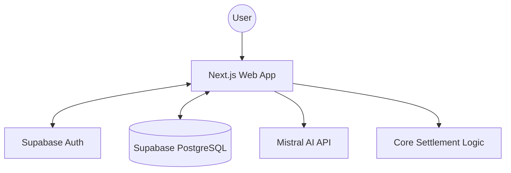
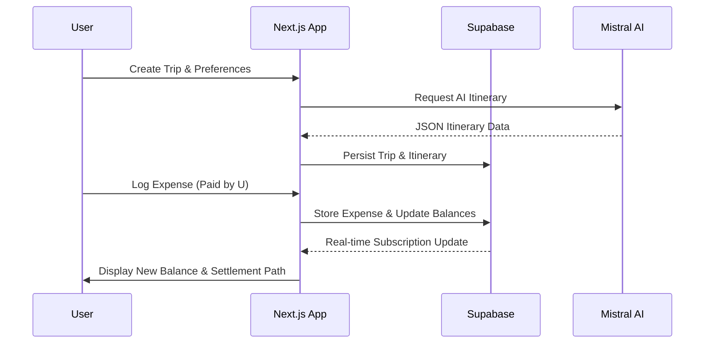

# TripSync AI — Intelligent Travel & Expense Management Platform 🌍💸

**Effortless travel coordination, automated expense splitting, and AI-powered trip planning—all in one place.**

---

## 📖 Overview
**TripSync AI** is a comprehensive travel management ecosystem designed to eliminate the friction of group travel. Whether you're planning a weekend getaway with friends or a long-haul international expedition, TripSync AI handles everything from **AI-generated itineraries** to **real-time expense tracking** and **automated debt settlement**. It serves as the single source of truth for group coordination, ensuring that everyone stays on the same page and every penny is accounted for.

---

## 🚨 Problem Statement
Group travel is often marred by three major pain points:
1.  **Fragmented Planning:** Itineraries are buried in WhatsApp chats, spreadsheets, and emails, leading to confusion.
2.  **Manual Expense Tracking:** Tracking "who paid for what" is tedious and error-prone, often resulting in awkward financial conversations at the end of a trip.
3.  **Complex Settlement:** Calculating "who owes whom" in a group of 5+ people is a mathematical headache, usually leading to dozens of unnecessary back-and-forth transactions.

---

## 💡 Solution
TripSync AI provides a unified, intelligent solution:
*   **Unified Itinerary:** One live dashboard for the entire group, generated by AI and customizable by members.
*   **Automated Finance:** Add expenses manually or via **simulated SMS/UPI detection**, and let the system handle the math.
*   **Optimal Settlement:** A sophisticated algorithm calculates the *minimum* number of transactions needed to clear all debts.
*   **Real-time Sync:** Powered by Supabase, every change is instantly visible to all participants.

---

## ✨ Key Features
*   **🤖 AI Itinerary Generation:** Leverages **Mistral AI** to create detailed day-wise plans based on budget, destination, and preferences.
*   **👥 Collaborative Trips:** Create a trip, generate a unique invite code, and have your friends join instantly.
*   **📊 Expense Management:** Track expenses across categories (Food, Transport, Stay, etc.) with support for multiple currencies.
*   **⚡ SMS/UPI Auto-Detection:** A simulation of mobile-first expense detection—paste a bank SMS, and the AI parses the merchant and amount.
*   **⚖️ Settle-Up System:** View real-time net balances. The system tells you exactly who to pay and how much.
*   **📈 AI Budget Insights:** Receive proactive warnings and tips from the Mistral-powered "Financial Advisor" regarding your spending habits.
*   **📱 Responsive Dashboard:** A premium, dark-mode UI optimized for both desktop planning and mobile "on-the-go" tracking.

---

## 🏗️ Technical Architecture

### System Flow


### Data Sequence


---

## 🧠 How It Works

1.  **Trip Initiation:** A user creates a trip by specifying the destination, dates, and budget. They can opt for an **AI-generated itinerary**.
2.  **Collaboration:** The creator shares an invite code. Friends join, and their profiles are synced via Supabase.
3.  **Expense Logging:** During the trip, members add expenses. The system automatically categorizes them (e.g., "Uber" -> Transport).
4.  **Automatic Splitting:** Every expense is split equally among participants by default, updating everyone's "Net Balance" in real-time.
5.  **Balance Calculation:** The system tracks `Net Balance = (Total Paid) - (Total Share)`. 
    *   *Positive balance:* You are owed money.
    *   *Negative balance:* You owe money.
6.  **Settlement Flow:** When the trip ends (or at any time), the **Settlement Algorithm** identifies the most efficient way to clear debts, minimizing the number of transfers.

---

## 🏗️ Tech Stack

*   **Frontend:** [Next.js 15](https://nextjs.org/) (App Router), [Tailwind CSS](https://tailwindcss.com/) for styling, [shadcn/ui](https://ui.shadcn.com/) for premium components, and [Framer Motion](https://www.framer.com/motion/) for fluid animations.
*   **Backend:** [Supabase](https://supabase.com/) for PostgreSQL database, Real-time subscriptions, and Authentication.
*   **AI Engine:** [Mistral AI](https://mistral.ai/) (`mistral-large-latest`) for itinerary generation and budget advisory.
*   **State Management:** React Context + Hooks for local state; Supabase for global/persistent state.
*   **Icons:** Lucide React.

---

## 🗄️ Database Design

The schema is optimized for relational integrity and fast lookups:

*   **`users`**: Stores profile information and global settings.
*   **`trips`**: Core trip data, including the JSONB itinerary and budget constraints.
*   **`trip_members`**: Junction table for the M:N relationship between users and trips (with roles: `admin` or `member`).
*   **`expenses`**: Detailed logs of every transaction, categorized and linked to a payer.
*   **`settlements`**: Records final payment transactions to "settle up" the trip.

---

## ⚙️ Core Logic

### 1. Expense Splitting
The system uses an **Equal Share** logic. For an expense $E$ with $N$ participants, each person's share is $S = E/N$. The payer's net balance increases by $(E - S)$, while other participants' balances decrease by $S$.

### 2. Settlement Algorithm (Transaction Minimization)
TripSync AI implements a greedy algorithm to resolve debts:
1.  Separate users into two groups: **Creditors** (owed money) and **Debtors** (owe money).
2.  Sort both groups by the magnitude of their balance.
3.  Match the largest debtor with the largest creditor.
4.  Create a transaction for `min(debt, credit)`.
5.  Update balances and repeat until all balances are near zero.

---

## 🔐 Security & Best Practices

*   **Row Level Security (RLS):** Every database query is scoped to the `trip_id`, ensuring users can only see expenses for trips they are members of.
*   **Environment Safety:** All API keys (Mistral, Supabase) are managed via `.env` variables and never exposed to the client-side where possible.
*   **Type Safety:** The entire project is built with **TypeScript**, ensuring robust data handling across the frontend and backend.
*   **Input Validation:** Strict Zod/Schema validation for all trip and expense inputs.

---

## 📱 UI/UX Design

*   **Glassmorphic Design:** A modern "Glass-on-Dark" aesthetic using backdrop blurs and subtle gradients.
*   **Micro-interactions:** Button hovers, layout transitions, and loading states powered by Framer Motion.
*   **Mobile-First:** A bottom-navigation layout for mobile users, making it easy to log expenses while walking or traveling.
*   **Information Hierarchy:** High-level "Financial Health" (Total Spent vs Budget) is always visible at the top of the dashboard.

---

## 🚀 Setup & Installation

### Prerequisites
*   Node.js 18+
*   Supabase Account
*   Mistral AI API Key

### Steps
1.  **Clone the Repo:**
    ```bash
    git clone https://github.com/yourusername/tripsync-ai.git
    cd tripsync-ai
    ```
2.  **Install Dependencies:**
    ```bash
    npm install
    ```
3.  **Environment Setup:** Create a `.env.local` file:
    ```env
    NEXT_PUBLIC_SUPABASE_URL=your_url
    NEXT_PUBLIC_SUPABASE_ANON_KEY=your_key
    MISTRAL_API_KEY=your_mistral_key
    ```
4.  **Database Migration:** Run the SQL scripts found in `/database/schema.sql` in your Supabase SQL editor.
5.  **Run Dev Server:**
    ```bash
    npm run dev
    ```

---

## 🌐 Deployment

### Frontend (Vercel/Netlify)
1.  Connect your GitHub repository.
2.  Set the build command to `npm run build`.
3.  Add the environment variables in the provider's dashboard.

### Backend (Supabase)
1.  Create a new project.
2.  Paste the SQL schema from `database/schema.sql` into the SQL Editor.
3.  Enable Auth providers as needed (Email/Google).

---

## 🎥 Demo
*   **Live App:** [https://tripsync-ai.vercel.app](https://trip-sync-ai.vercel.app/)
*   **Video Walkthrough:** [YouTube Link](https://youtu.be/J73vd6QIoyU?si=Sr_G3hZYxsyrjjqC)

---

## 🔮 Future Scope
*   **Real Payment Integration:** Integrate Razorpay/Stripe for actual 1-click settlements within the app.
*   **OCR Receipt Scanning:** Use Vision AI to parse physical receipts instead of just SMS.
*   **Offline Mode:** Service worker support for logging expenses without an internet connection (common during travel).
*   **Flight/Hotel API Integration:** Live booking and price tracking directly in the itinerary.

---

## 🏁 Conclusion
TripSync AI isn't just a tracker; it's a **travel co-pilot**. By combining high-performance backend architecture with cutting-edge AI, it transforms the chaotic process of group travel into a streamlined, enjoyable experience. It is built to scale, from small friend groups to large-scale corporate retreats.

---

**Built with ❤️ for the Next-Gen Traveler.**
