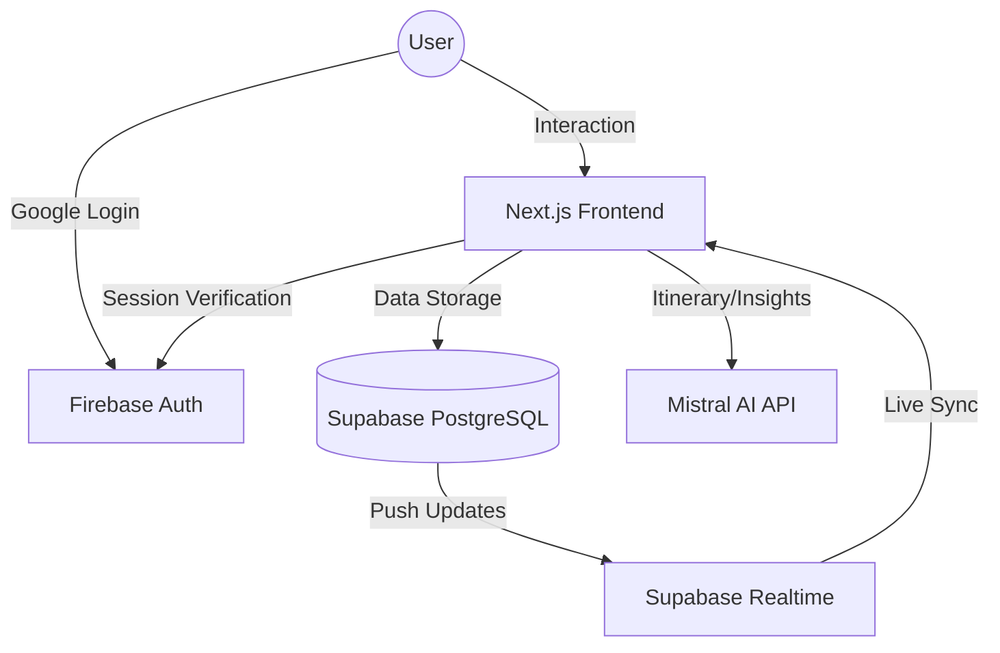

# ✈️ TripSync AI
### Plan together. Spend smarter. Settle instantly.

[](https://nextjs.org/)
[](https://mistral.ai/)
[](https://supabase.com/)
[](https://firebase.google.com/)

---

## 🚀 1. Introduction

**TripSync AI** is a production-ready group travel platform designed to eliminate the two biggest headaches of group trips: **chaotic planning** and **financial friction**.

### The Problem
Traditional group travel involves messy WhatsApp threads for planning, complicated spreadsheets for expenses, and awkward "who owes whom" conversations at the end of the trip. Manual tracking is slow, prone to error, and ruins the vacation vibe.

### The Solution
TripSync AI combines high-performance LLMs (**Mistral AI**) with real-time infrastructure (**Supabase**) to provide:
1. **Instant Itineraries**: AI generates day-wise plans based on your group's budget and style.
2. **Real-Time Split**: Every expense is tracked and split instantly across the group.
3. **Automated Settlement**: The app calculates the mathematically optimal way to settle debts with the fewest transactions.

---

## ✨ 2. Features

### 🧠 AI Intelligence (Powered by Mistral AI)
*   **Dynamic Itinerary Generation**: Enter your destination and budget, and Mistral AI builds a realistic, day-wise plan including morning, afternoon, and evening activities with cost estimates.
*   **Smart Budget Insights**: The AI analyzes your group's spending patterns and provides actionable tips (e.g., "You've spent 40% of your budget on food; consider local markets for the next 2 days").
*   **Auto-Categorization**: Intelligently classifies expenses into Food, Transport, Stay, Activities, and Shopping.

### 💸 Expense Management
*   **Multi-User Splitting**: Add an expense and choose exactly who is involved.
*   **Live Balance Tracking**: See who is "in the green" and who needs to pay up at any second.
*   **One-Click Settlements**: Mark payments as paid and watch the group debt dissolve in real-time.

### 👥 Collaboration & Social
*   **Invite-Only Trips**: Secure trips accessible via a unique 8-character invite code.
*   **Group Voting**: Can't decide on dinner? Create a poll and let the group vote in real-time.
*   **Shared Dashboard**: A central command center for the entire group's itinerary and finances.

### ⚡ Real-Time Experience
*   Built on Supabase Realtime, ensuring that when one person adds an expense, everyone’s screen updates instantly without a refresh.

---

## 🛠️ 3. Tech Stack

| Layer | Technology |
| :--- | :--- |
| **Frontend** | Next.js 15 (App Router), Tailwind CSS, Framer Motion |
| **UI Components** | ShadCN UI, Lucide Icons |
| **Authentication** | Firebase Auth (Google OAuth) |
| **Database** | Supabase (PostgreSQL) |
| **Realtime** | Supabase Realtime Subscriptions |
| **AI Engine** | Mistral AI (Mistral Large Latest) |
| **Deployment** | Vercel |

---

## 🧱 4. System Architecture

TripSync AI uses a modern, decoupled architecture to ensure speed and scalability.



1.  **Next.js** serves as the core application engine.
2.  **Firebase** handles secure Google authentication and session persistence.
3.  **Supabase** acts as the source of truth, storing relational data and broadcasting changes via WebSockets (Realtime).
4.  **Mistral AI** is queried via server-side routes to process natural language tasks like trip planning and financial auditing.

---

## 📊 5. Database Schema (Overview)

The database is built on PostgreSQL with the following core relationships:

*   **`users`**: Stores profile information (UID from Firebase).
*   **`trips`**: The main entity containing destination, budget, and AI-generated itinerary JSON.
*   **`trip_members`**: A junction table linking users to trips with roles (`admin` or `member`).
*   **`expenses`**: Tracks every transaction, linked to a payer and an array of split-members.
*   **`settlements`**: Records debt-clearing transactions between specific users.
*   **`votes`**: Handles group polls for collaborative decision making.

---

## 🎬 6. Demo Flow

1.  **Auth**: Sign in via Google.
2.  **Creation**: Create a "New Trip" (e.g., "Goa 2024") and set a budget.
3.  **Invite**: Share the unique code with friends.
4.  **Plan**: Click "Generate Itinerary" to let Mistral AI draft your 5-day plan.
5.  **Spend**: Add a ₹2000 dinner expense. Mark 3 friends to split.
6.  **Insights**: Check "AI Insights" to see if you're overspending on transport.
7.  **Settle**: End of the trip? Hit "Mark Paid" on settlements to clear all debts.

---

## ⚙️ 7. Installation & Setup

### Prerequisites
*   Node.js 18+
*   A Supabase Project
*   A Firebase Project (with Google Auth enabled)
*   A Mistral AI API Key

### Steps
1.  **Clone the Repo**
    ```bash
    git clone https://github.com/yourusername/tripsync-ai.git
    cd tripsync-ai
    ```

2.  **Install Dependencies**
    ```bash
    npm install
    ```

3.  **Environment Variables**
    Create a `.env.local` file and add the following:
    ```env
    # Supabase
    NEXT_PUBLIC_SUPABASE_URL=your_supabase_url
    NEXT_PUBLIC_SUPABASE_ANON_KEY=your_anon_key

    # Firebase
    NEXT_PUBLIC_FIREBASE_API_KEY=...
    NEXT_PUBLIC_FIREBASE_AUTH_DOMAIN=...
    NEXT_PUBLIC_FIREBASE_PROJECT_ID=...

    # AI
    MISTRAL_API_KEY=your_mistral_key
    ```

4.  **Database Setup**
    Run the contents of `database/schema.sql` in your Supabase SQL Editor.

5.  **Run Locally**
    ```bash
    npm run dev
    ```
    Access the app at `http://localhost:3000`.

---

## 🧠 8. AI Usage Explanation

We chose **Mistral AI** (Mistral Large Latest) over other providers for its exceptional reasoning-to-latency ratio and native support for **JSON Mode**.

*   **Itinerary Generation**: We use a structured prompt that forces Mistral to return a typed JSON schema, which our frontend parses into the interactive timeline.
*   **Budget Insights**: Mistral processes a snapshot of the group's `categoryBreakdown` and `percentSpent` to generate human-like advice, detecting overspending before it becomes a problem.

---

## 📈 9. Future Scope

*   **UPI Integration**: Direct "Pay via UPI" buttons generated from settlement cards.
*   **SMS Auto-Detection**: Background scanning of bank/UPI SMS to automatically log expenses.
*   **B2B Dashboard**: White-label version for travel agencies to manage group bookings.
*   **Flight/Hotel APIs**: Integration with Skyscanner/Expedia to book the AI-suggested itinerary directly.

---

## 🏆 10. Why This Project Stands Out

*   **Real-World Utility**: It solves a universal pain point in group travel.
*   **Seamless Integration**: Combines AI, Fintech (Expense tracking), and Social (Collaboration).
*   **Technical Depth**: Implements Realtime WebSockets, Complex SQL relationships, and LLM-driven structured data.
*   **Modern UX**: Premium, dark-themed design with buttery smooth animations (Framer Motion).

---

## 📄 11. License
Distributed under the MIT License. See `LICENSE` for more information.

---
**Made with <3 **
